# Python Pipeline Data Flow
## Repos: `antonindanalet/mode_choice_tourists` + `antonindanalet/simba-python` → `src/simba/mobi/synpop/tourists`

Paste into [mermaid.live](https://mermaid.live) to render.

```mermaid
flowchart TD

    classDef extData  fill:#dae8fc,stroke:#6c8ebf,color:#000
    classDef script1  fill:#d5e8d4,stroke:#82b366,color:#000,font-weight:bold
    classDef script2  fill:#e1d5e7,stroke:#9673a6,color:#000,font-weight:bold
    classDef intermed fill:#fff2cc,stroke:#d6b656,color:#000
    classDef finalOut fill:#f8cecc,stroke:#b85450,color:#000,font-weight:bold
    classDef visum    fill:#f0f0f0,stroke:#999999,color:#000,font-style:italic

    %% ============================================================
    %% REPO 1 — mode_choice_tourists
    %% ============================================================
    subgraph MCT["Repo 1 — antonindanalet/mode_choice_tourists"]
        direction TB

        subgraph EXT1["External data sources"]
            direction LR
            TMS["TMS survey .sav\n(26_TMS_final SBB_\nDatenlieferung_Februar2023.sav)"]:::extData
            SL["Raumgliederungen_\nStadtLand2017.xlsx\n(FSO urban/rural typology)"]:::extData
            AMR["Raumgliederungen_\nAMR2018.xlsx\n(FSO AMR Grossregionen)"]:::extData
        end

        GD["get_data.py\n\nReads TMS .sav via pyreadstat.\nMaps commune codes to names.\nJoins urban/rural typology\nand AMR region from FSO xlsx.\nReturns cleaned DataFrame."]:::script1

        MAIN["main.py\n\nCalls get_data().\nBuilds Biogeme MNL database.\nDefines utility functions for\n7 modes x variables\n(nationality, accommodation type,\nurban/rural, region, stars).\nEstimates model with biogeme."]:::script1

        MODEL_OUT[["data/output/\nmode_choice_tourists.html\nmode_choice_tourists.pickle\nmode_choice_tourists.tex\n(estimated MNL coefficients)"]]:::finalOut
    end

    TMS --> GD
    SL  --> GD
    AMR --> GD
    GD  -->|"cleaned DataFrame\n(in memory)"| MAIN
    MAIN --> MODEL_OUT

    %% ============================================================
    %% REPO 2 — simba-python / tourists
    %% ============================================================
    subgraph SPT["Repo 2 — simba-python / src/simba/mobi/synpop/tourists"]
        direction TB

        subgraph EXT2["External data sources"]
            direction LR
            HESTA_C["HESTA commune-level.xlsx\n(hotel overnights by\ncountry x commune)"]:::extData
            HESTA_K["HESTA canton-level.csv\n(hotel overnights by\ncountry x canton)"]:::extData
            COMM_K["communes_by_canton.xlsx\n(FSO commune to\ncanton mapping)"]:::extData
            PASTA_H["PASTA holiday homes.xlsx\n(overnights by\nmajor region)"]:::extData
            PASTA_CA["PASTA collective\naccommodation.xlsx"]:::extData
            PASTA_CS["PASTA campsites.xlsx"]:::extData
            MR_SHP["Swiss major regions\nshapefile\n(Grossregionen)"]:::extData
            OSM["OpenStreetMap\nlive API via osmnx"]:::extData
            ZONES["zones.gpkg\n(NPVM traffic zones)"]:::extData
        end

        GTH["get_tourists_and_hotels.py\n(orchestrator)\n\nCalls load_overnights_in_hotels()\nand load_overnights_in_\nsupplementary_accommodation()"]:::script2

        LOAD_H["load_overnights_in_hotels.py\n\nReads HESTA xlsx at commune\nand canton level.\nQueries OSM for hotels, motels,\nguest_houses per commune + canton.\nJoins NPVM zone_id via sjoin\non zones.gpkg.\nRounds daily overnights\nkeeping national total."]:::script2

        LOAD_S["load_overnights_in_\nsupplementary_accommodation.py\n\nReads PASTA xlsx for holiday homes,\ncollective accommodation, campsites.\nUses major regions shapefile as\nboundaries for OSM queries:\nchalets, apartments, hostels,\nalpine_huts, wilderness_huts,\ncamp_sites.\nJoins NPVM zone_id via sjoin."]:::script2

        subgraph INT_H["Intermediates — hotels (cached with date stamp)"]
            direction LR
            OH_D["overnights_in_hotels_\ndetailed.csv\n(daily, by country x commune)"]:::intermed
            OH_K["overnights_in_hotels_in_\ncantons_only.csv\n(residual canton-level overnights)"]:::intermed
            COMM_LIST["list_of_communes_\nwith_hotels.json\n(communes with 3+ hotels)"]:::intermed
            H_OSM["hotels_with_id_zones.csv\n(OSM hotels + zone_id + beds)"]:::intermed
        end

        subgraph INT_S["Intermediates — supplementary accommodation (cached with date stamp)"]
            direction LR
            OH_HH["overnights_in_\nholiday_homes.csv"]:::intermed
            OH_CA["overnights_in_collective_\naccommodation.csv"]:::intermed
            OH_CS["overnights_in_\ncampsites.csv"]:::intermed
            HH_Z["holiday_homes_with_\nid_zones.csv"]:::intermed
            CA_Z["collective_accommodation_\nwith_id_zones.csv"]:::intermed
            CS_Z["campsites_with_\nid_zones.csv"]:::intermed
        end

        DIST["distribute_tourists_in_\ntourist_accommodation.py\n\nLoads all hotel + supplementary\naccommodation intermediates.\nAssigns household_id to each\naccommodation point.\nDistributes overnights to agents\nproportional to beds,\nweighted random draw per commune\n(hotels) or region (supplementary).\nAdds age from TMS distribution.\nOutputs persons + households\nfor VISUM import."]:::script2

        PERSONS[["persons.csv\n(agent_id, household_id,\ncountry_of_origin, age,\nemployment attrs)"]]:::finalOut
        HOUSEHOLDS[["households.csv\n(household_id, zone_id,\nx, y, beds, stars,\naccommodation category)"]]:::finalOut
    end

    GTH --> LOAD_H
    GTH --> LOAD_S

    HESTA_C  --> LOAD_H
    HESTA_K  --> LOAD_H
    COMM_K   --> LOAD_H
    OSM      --> LOAD_H
    ZONES    --> LOAD_H

    LOAD_H --> OH_D
    LOAD_H --> OH_K
    LOAD_H --> COMM_LIST
    LOAD_H --> H_OSM

    PASTA_H  --> LOAD_S
    PASTA_CA --> LOAD_S
    PASTA_CS --> LOAD_S
    MR_SHP   --> LOAD_S
    OSM      --> LOAD_S
    ZONES    --> LOAD_S

    LOAD_S --> OH_HH
    LOAD_S --> OH_CA
    LOAD_S --> OH_CS
    LOAD_S --> HH_Z
    LOAD_S --> CA_Z
    LOAD_S --> CS_Z

    INT_H --> DIST
    INT_S --> DIST
    DIST  --> PERSONS
    DIST  --> HOUSEHOLDS

    %% ============================================================
    %% CONNECTION BETWEEN REPOS (via VISUM)
    %% ============================================================
    VISUM["VISUM / MOBi\n\nImports households.csv + persons.csv\nas synthetic tourist agents.\nApplies estimated MNL coefficients\nto assign transport mode\nto each agent trip."]:::visum

    MODEL_OUT  -.->|"MNL coefficients\napplied in VISUM"| VISUM
    PERSONS    --> VISUM
    HOUSEHOLDS --> VISUM
```

